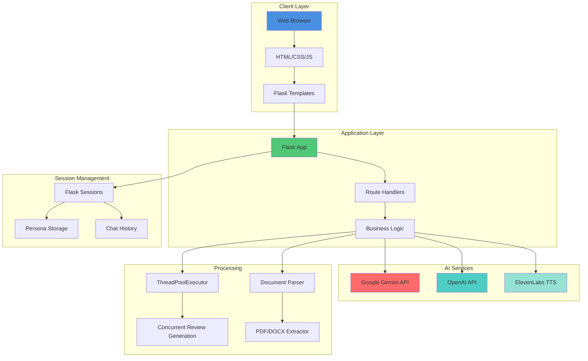
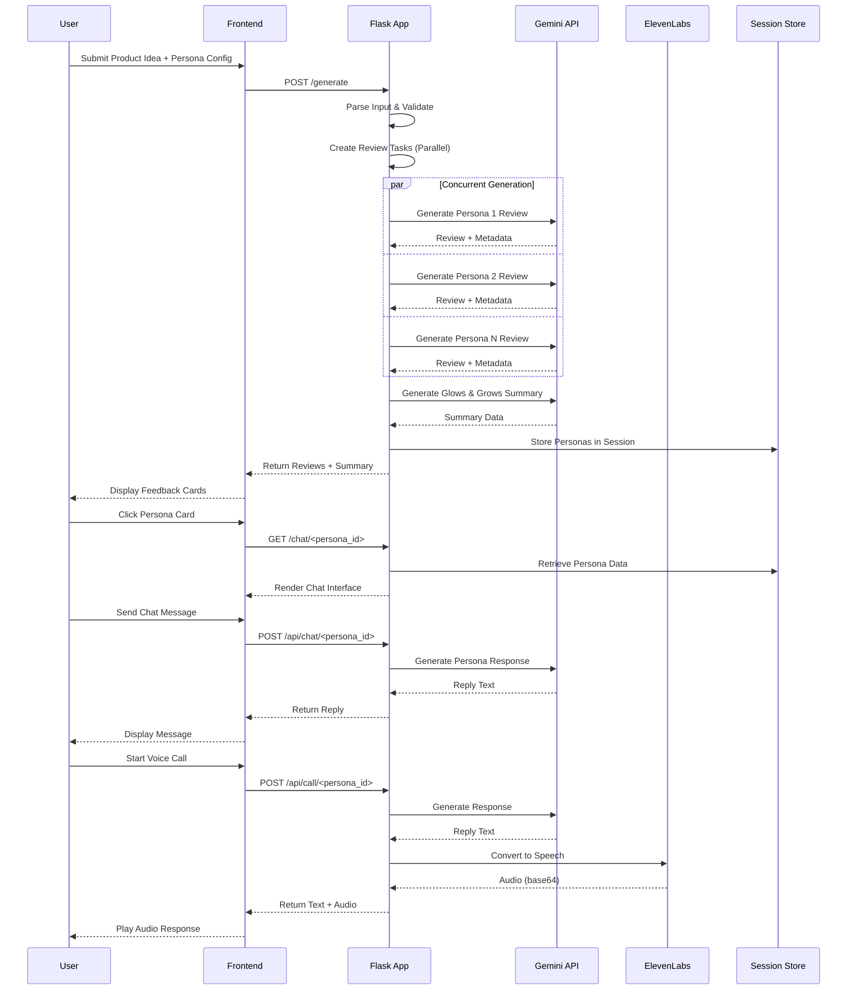
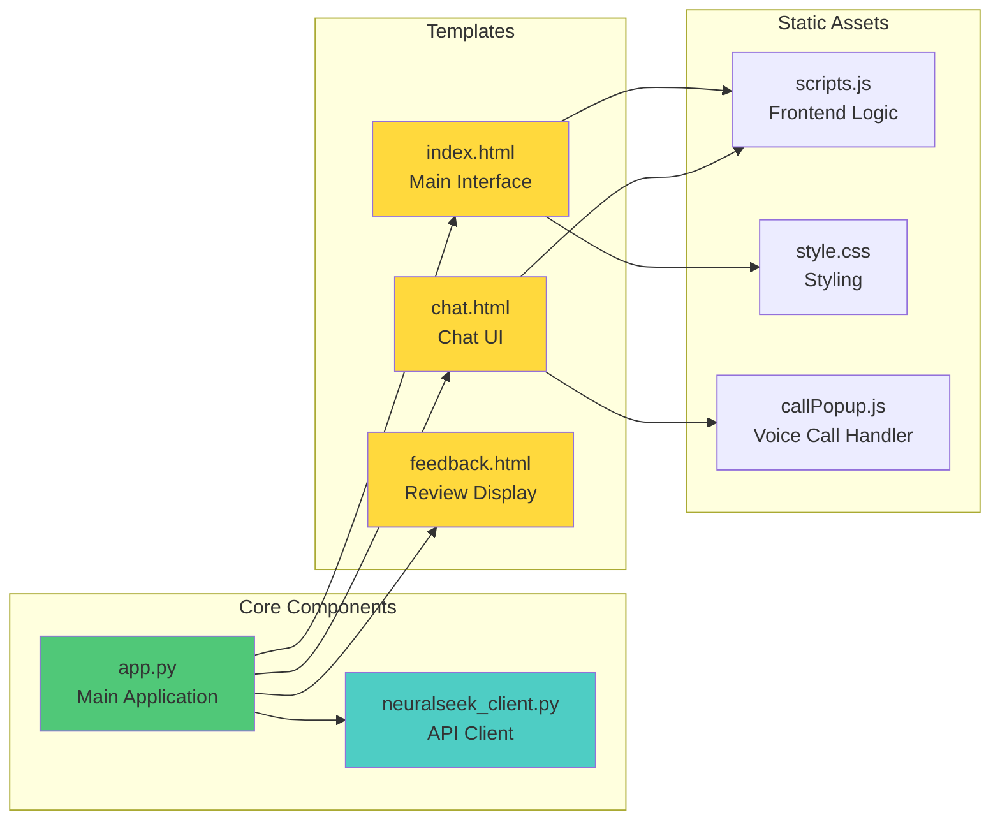
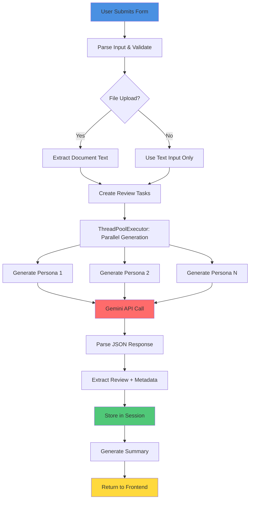
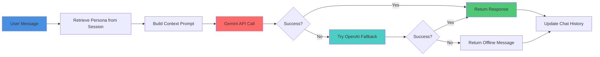

# 🧠 NeuralFeedback

<div align="center">

**AI-Powered Persona-Based Product Feedback Platform**

*Transform your product ideas into actionable insights through intelligent AI personas*

[](https://www.python.org/)
[](https://flask.palletsprojects.com/)
[](LICENSE)

</div>

---

## 📋 Table of Contents

- [Overview](#-overview)
- [Features](#-features)
- [Architecture](#-architecture)
- [Technology Stack](#-technology-stack)
- [Installation](#-installation)
- [Configuration](#-configuration)
- [Usage](#-usage)
- [API Endpoints](#-api-endpoints)
- [Project Structure](#-project-structure)
- [Contributing](#-contributing)

---

## 🎯 Overview

**NeuralFeedback** is an intelligent web application that generates diverse, persona-based feedback for product ideas and concepts. By leveraging advanced AI models (Google Gemini, OpenAI) and text-to-speech technology (ElevenLabs), it creates realistic reviewer personas with unique characteristics, demographics, and perspectives to provide comprehensive product evaluation.

### Key Capabilities

- **Multi-Persona Generation**: Create 1-20 unique AI personas with customizable traits
- **Intelligent Feedback**: Generate contextual reviews based on product descriptions
- **Interactive Chat**: Engage in real-time conversations with each persona
- **Voice Calls**: Experience natural voice interactions with AI personas
- **Document Analysis**: Upload PDF, DOC, or DOCX files for enhanced context
- **Feedback Summarization**: Automatic "Glows & Grows" analysis of all feedback

---

## ✨ Features

### 🎭 Persona Customization
- **10 Personality Traits**: Analytical, Creative, Practical, Emotional, Skeptical, Optimistic, Detail-oriented, Impulsive, Cautious, Adventurous
- **Demographic Filters**: Age range, gender, location selection
- **Intensity Levels**: Fine-tune trait intensity (somewhat, moderately, very)
- **Dynamic Persona Generation**: Each persona gets unique name, profession, tone, and characteristics

### 💬 Interactive Features
- **Text Chat**: Real-time conversational interface with each persona
- **Voice Calls**: Natural speech-to-speech interactions using ElevenLabs
- **Context Preservation**: Personas maintain consistency across conversations
- **Session Management**: Persistent persona data throughout user session

### 📊 Feedback Analysis
- **Rating System**: 1-10 sentiment ratings per persona
- **Glows & Grows**: Automated summary of strengths and improvement areas
- **Concurrent Processing**: Parallel generation of multiple reviews using ThreadPoolExecutor
- **Fallback System**: Graceful degradation when APIs are unavailable

### 📄 Document Support
- **File Upload**: PDF, DOC, DOCX document parsing
- **Context Integration**: Extracted text enhances persona understanding
- **Secure Processing**: File validation and safe handling

---

## 🏗️ Architecture

### System Architecture Diagram



### Data Flow Diagram



### Component Architecture



---

## 🛠️ Technology Stack

### Backend
- **Flask 3.0.0**: Web framework and routing
- **Python 3.8+**: Core language
- **python-dotenv**: Environment variable management
- **ThreadPoolExecutor**: Concurrent review generation

### AI & ML Services
- **Google Gemini 2.0 Flash Lite**: Primary LLM for persona generation and chat
- **OpenAI GPT-4o-mini**: Fallback LLM for chat responses
- **ElevenLabs**: Text-to-speech for voice calls

### Document Processing
- **pdfplumber**: PDF text extraction
- **python-docx**: DOCX file parsing

### Frontend
- **HTML5/CSS3**: Modern responsive UI
- **Vanilla JavaScript**: Client-side interactivity
- **Web Speech API**: Browser-based speech recognition
- **Glassmorphism Design**: Modern UI aesthetic

### Session & Storage
- **Flask Sessions**: Server-side session management
- **JSON**: Data serialization

---

## 📦 Installation

### Prerequisites

- Python 3.8 or higher
- pip (Python package manager)
- Git (for cloning the repository)

### Step-by-Step Setup

1. **Clone the repository**
   ```bash
   git clone <repository-url>
   cd NeuralFeedback
   ```

2. **Create a virtual environment** (recommended)
   ```bash
   python -m venv venv
   
   # On Windows
   venv\Scripts\activate
   
   # On macOS/Linux
   source venv/bin/activate
   ```

3. **Install dependencies**
   ```bash
   pip install -r requirements.txt
   ```

4. **Configure environment variables**
   
   Create a `.env` file in the project root:
   ```env
   # Required
   FLASK_SECRET_KEY=your-secret-key-here
   GEMINI_API_KEY=your-gemini-api-key
   
   # Optional but recommended
   ELEVENLABS_API_KEY=your-elevenlabs-api-key
   ELEVENLABS_VOICE_ID_DEFAULT=your-voice-id
   ELEVENLABS_VOICE_ID_MALE=your-male-voice-id
   ELEVENLABS_VOICE_ID_FEMALE=your-female-voice-id
   ELEVENLABS_VOICE_ID_NONBINARY=your-nonbinary-voice-id
   
   # Optional fallback
   OPENAI_API_KEY=your-openai-api-key
   
   # Optional: NeuralSeek integration
   NEURALSEEK_API_KEY=your-neuralseek-api-key
   NEURALSEEK_API_URL=https://api.neuralseek.com/v1/seek
   NEURALSEEK_CHAT_URL=https://api.neuralseek.com/v1/chat
   ```

5. **Run the application**
   ```bash
   python app.py
   ```

6. **Access the application**
   
   Open your browser and navigate to:
   ```
   http://localhost:5000
   ```

---

## ⚙️ Configuration

### Environment Variables

| Variable | Required | Description |
|----------|----------|-------------|
| `FLASK_SECRET_KEY` | ✅ Yes | Secret key for Flask session encryption |
| `GEMINI_API_KEY` | ✅ Yes | Google Gemini API key for persona generation |
| `ELEVENLABS_API_KEY` | ⚠️ Optional | ElevenLabs API key for voice calls |
| `ELEVENLABS_VOICE_ID_*` | ⚠️ Optional | Voice IDs for different genders |
| `OPENAI_API_KEY` | ⚠️ Optional | OpenAI API key as fallback for chat |
| `NEURALSEEK_API_KEY` | ⚠️ Optional | NeuralSeek API key (legacy support) |

### API Key Setup

#### Google Gemini API
1. Visit [Google AI Studio](https://makersuite.google.com/app/apikey)
2. Create a new API key
3. Copy the key to `GEMINI_API_KEY` in your `.env` file

#### ElevenLabs API
1. Sign up at [ElevenLabs](https://elevenlabs.io/)
2. Navigate to your profile → API Keys
3. Create a new API key
4. Copy the key to `ELEVENLABS_API_KEY` in your `.env` file
5. Optionally configure voice IDs for different personas

#### OpenAI API (Optional)
1. Visit [OpenAI Platform](https://platform.openai.com/)
2. Create an API key
3. Copy the key to `OPENAI_API_KEY` in your `.env` file

---

## 🚀 Usage

### Basic Workflow

1. **Describe Your Product**
   - Enter your product idea in the text area
   - Optionally upload a PDF, DOC, or DOCX document for additional context

2. **Configure Personas**
   - Select personality traits (e.g., Analytical, Creative, Skeptical)
   - Choose number of reviewers (1-20)
   - Set age range, gender, and location filters

3. **Generate Feedback**
   - Click "Generate AI Client Responses"
   - Wait for concurrent generation to complete
   - Review the generated persona feedback cards

4. **Interact with Personas**
   - Click on any persona card to open a chat interface
   - Ask follow-up questions about their feedback
   - Use voice call feature for natural conversations

5. **Review Summary**
   - Check the "Glows & Grows" section for automated insights
   - Identify common themes across all feedback

### Advanced Features

#### Voice Calls
- Click the phone icon on a persona card
- Grant microphone permissions
- Speak naturally - the persona will respond with voice
- Conversation history is maintained throughout the call

#### Document Upload
- Supported formats: PDF, DOC, DOCX
- Maximum recommended size: 5MB
- Extracted text is used to enhance persona understanding
- First 3000 characters are included in the generation prompt

#### Custom Persona Traits
The application supports 10 predefined traits with three intensity levels:
- **Somewhat** (0.9x intensity)
- **Moderately** (1.0x intensity)
- **Very** (1.1x intensity)

---

## 🔌 API Endpoints

### Main Routes

#### `GET /`
Renders the main application interface.

**Response**: HTML page with product input form

---

#### `POST /generate`
Generates multiple persona-based reviews.

**Request Body** (multipart/form-data or JSON):
```json
{
  "text": "Product idea description",
  "numReviews": 5,
  "characteristics": ["analytical", "creative"],
  "ageMin": 25,
  "ageMax": 45,
  "gender": "Female",
  "location": "North America",
  "ideaFile": "<file>"
}
```

**Response**:
```json
{
  "inputText": "Product idea...",
  "numReviews": 5,
  "reviews": [
    {
      "id": 1,
      "review": "Feedback text...",
      "metadata": {
        "persona_name": "Alex Johnson, 32",
        "persona_descriptor": "Analytical product designer",
        "sentiment_rating": 7,
        "characteristics": ["analytical", "detail-oriented"],
        "age": 32,
        "gender": "Female",
        "location": "North America",
        "profession": "Product Designer",
        "tone": "supportive"
      }
    }
  ],
  "successCount": 5,
  "errorCount": 0,
  "glows": ["Positive aspect 1", "Positive aspect 2"],
  "grows": ["Improvement area 1", "Improvement area 2"]
}
```

---

#### `GET /chat/<persona_id>`
Renders the chat interface for a specific persona.

**Parameters**:
- `persona_id` (int): ID of the persona to chat with

**Response**: HTML page with chat interface

---

#### `POST /api/chat/<persona_id>`
Sends a chat message to a persona and receives a response.

**Request Body**:
```json
{
  "message": "What do you think about the pricing strategy?"
}
```

**Response**:
```json
{
  "reply": "Based on my analytical perspective, the pricing needs..."
}
```

---

#### `POST /api/call/<persona_id>`
Initiates a voice call with a persona.

**Request Body**:
```json
{
  "message": "Hello, can you tell me more?",
  "persona_name": "Alex Johnson",
  "tone": "supportive",
  "gender": "Female",
  "initial": false,
  "history": [
    {"role": "user", "content": "Previous message"},
    {"role": "assistant", "content": "Previous response"}
  ]
}
```

**Response**:
```json
{
  "reply": "Text response from persona",
  "audio": "base64-encoded-audio-data"
}
```

---

## 📁 Project Structure

```
NeuralFeedback/
│
├── app.py                      # Main Flask application
├── neuralseek_client.py        # NeuralSeek API client (legacy)
├── requirements.txt            # Python dependencies
├── .env                        # Environment variables (not in git)
├── .gitignore                  # Git ignore rules
├── env.example                 # Example environment file
│
├── templates/                  # Jinja2 HTML templates
│   ├── index.html             # Main landing page
│   ├── chat.html              # Chat interface
│   ├── reviews.html           # Review display page
│   └── feedback.html          # Feedback card component
│
├── static/                     # Static assets
│   ├── css/
│   │   └── callPopup.css     # Voice call popup styles
│   ├── audio/
│   │   └── ring.mp3          # Call ringtone
│   ├── scripts.js            # Main frontend JavaScript
│   ├── callPopup.js          # Voice call functionality
│   └── style.css             # Main stylesheet
│
└── README.md                  # This file
```

### Key Files Description

- **`app.py`**: Core application logic, route handlers, AI integration, and session management
- **`neuralseek_client.py`**: Legacy NeuralSeek API integration (optional)
- **`templates/index.html`**: Main user interface with product input and persona configuration
- **`templates/chat.html`**: Real-time chat interface for persona interactions
- **`static/scripts.js`**: Frontend logic for form handling, API calls, and UI updates
- **`static/callPopup.js`**: Voice call implementation with Web Speech API

---

## 🔄 Processing Flow

### Review Generation Process



### Chat Response Flow



---

## 🎨 Design Philosophy

### UI/UX Principles

- **Glassmorphism**: Modern frosted glass aesthetic with transparency and blur effects
- **Dark Theme**: Eye-friendly dark background with neon accent colors
- **Responsive Design**: Mobile-first approach with adaptive layouts
- **Real-time Feedback**: Immediate visual updates during processing
- **Accessibility**: Keyboard navigation and screen reader support

### Color Scheme

- **Primary**: Cyan (#00ffff) - Main actions and highlights
- **Secondary**: Violet (#8b5cf6) - Secondary actions
- **Background**: Dark (#0a0e27) - Base background
- **Cards**: Semi-transparent with blur effects
- **Text**: Light gray/white for readability

---

## 🐛 Troubleshooting

### Common Issues

#### API Key Errors
**Problem**: "Gemini API key not configured"  
**Solution**: 
- Verify `.env` file exists in project root
- Check `GEMINI_API_KEY` is set correctly
- Restart the Flask server after updating `.env`

#### Voice Calls Not Working
**Problem**: No audio playback or microphone access  
**Solution**:
- Grant browser microphone permissions
- Verify `ELEVENLABS_API_KEY` is configured
- Check browser console for errors
- Ensure HTTPS in production (required for microphone)

#### Document Upload Fails
**Problem**: File not processing  
**Solution**:
- Verify file format (PDF, DOC, DOCX only)
- Check file size (recommended < 5MB)
- Ensure `pdfplumber` and `python-docx` are installed
- Check server logs for parsing errors

#### Session Data Lost
**Problem**: Personas disappear on refresh  
**Solution**:
- Verify `FLASK_SECRET_KEY` is set
- Check browser allows cookies
- Ensure session storage is enabled

---

## 🔒 Security Considerations

- **API Keys**: Never commit `.env` file to version control
- **File Uploads**: Files are validated and processed securely
- **Session Management**: Flask sessions use secure cookies
- **Input Validation**: All user inputs are sanitized
- **Error Handling**: Graceful fallbacks prevent information leakage

---

## 📝 License

This project is licensed under the MIT License - see the LICENSE file for details.

---

## 🤝 Contributing

Contributions are welcome! Please feel free to submit a Pull Request.

1. Fork the repository
2. Create your feature branch (`git checkout -b feature/AmazingFeature`)
3. Commit your changes (`git commit -m 'Add some AmazingFeature'`)
4. Push to the branch (`git push origin feature/AmazingFeature`)
5. Open a Pull Request

---

## 📧 Support

For issues, questions, or contributions, please open an issue on the repository.

---

<div align="center">

**Built with ❤️ using Flask, Gemini AI, and modern web technologies**

*Transform ideas into insights, one persona at a time*

</div>
